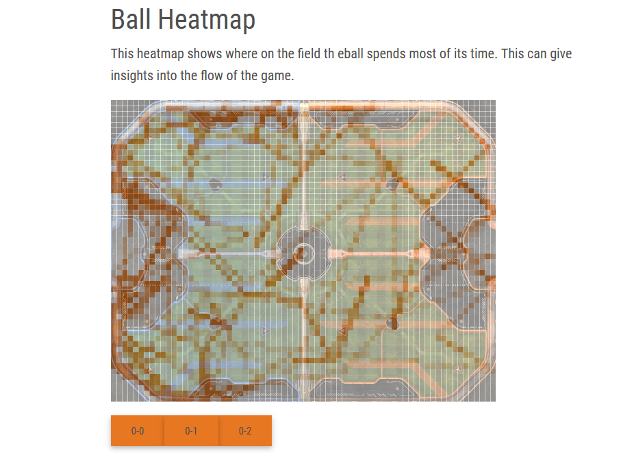

BESSY Axel  
DAKHLI Sonia  
LERAY Nicolas

# Rocket-Viz

Projet de visualisation des données du jeu Rocket League.
Rocket League est un jeu vidéo dont le but est de marquer des buts en utilisant des voitures pour frapper un ballon dans un but adverse, combinant ainsi des éléments de football et de conduite.

Nous utilisons : https://github.com/nickbabcock/rrrocket pour parser un fichier de replay Rocket League en fichier json.

## Séparation du travail

Nous avons chacun travaillé sur différentes parties :

- **Nicolas** : Timeline.
- **Axel** : Heatmap et json.
- **Sonia** : tableau des scores, statistiques par équipe, diagramme pression.

## Suivi

### 13/12/2023 - Définition du projet

Choix du sujet : Analyse de données personnelles du jeu **Rocket-League**.

### 19/12/2023 - Début du projet

Chargement et début du traitement du fichier json.

### 19/12/2023 => 16/01/2024 - Début de la partie Statistique globales

#### Nicolas

- (Depuis le 19/12/2023) Affichage de la **timeline**.

#### Axel

- (19/12/2023) : Scripts pour la compréhension du json.
- (Depuis le 19/12/2023) Affichage de la **heatmap**.
- (06/01/2024) : Ajout de la **heatmap** dynamique en fonction du temps.
- (10/01/2024) : Lien des parties hors page principale.
- (Depuis le 16/01/2024) : Nettoyage et lien entre la **heatmap** et la **slider**.
- (Depuis le 10/01/2024) : Boostrap et mise en forme de la page principale.

#### Sonia

- (19/12/2023) Affichage d'un premier **tableau des scores** sans mise en forme.
- (Depuis le 09/01/2024) Amélioration du **tableau des scores**, ajout des **statistiques par équipe** et du diagramme circulaire de **pressure**.

### 16/01/2024 => 22/01/2024
- Création de l'**histogramme** lors du clic sur un joueur dans le tableau des scores. Ce dernier permet de comparer le joueur sélectionné à la moyenne de tous les joueurs, de ses alliés, de ses ennemis ou d'un joueur en pariculier.
- Améliorations graphiques : harmonisation des styles.
- Ajout du **slider** permettant de connecter la timeline, la hitmap et le diagramme circulaire de pression.
- Ajout de fichiers pré-chargés.

## Structure du projet

### Timeline

La timeline est une représentation visuelle des événements clés qui se produisent pendant un match. Elle permet aux joueurs de comprendre rapidement le déroulement du match et de repérer les moments importants.

#### Fonctionnalités de la Timeline

La timeline de Rocket League comprend les fonctionnalités suivantes :

**Buts** : Les buts marqués par chaque équipe sont représentés sur la timeline. Chaque but est représenté par une icône de ballon de football, placée à l'endroit exact de la timeline où le but a été marqué.

**Démolitions** : Les démolitions (lorsqu'un joueur détruit un autre joueur en le percutant à grande vitesse) sont également représentées sur la timeline. Chaque démolition est représentée par une icône d'explosion, placée à l'endroit exact de la timeline où la démolition a eu lieu.

**Sauvegardes** : Les sauvegardes (lorsqu'un joueur empêche un but en déviant le ballon) sont représentées sur la timeline. Chaque sauvegarde est représentée par une icône de bouclier, placée à l'endroit exact de la timeline où la sauvegarde a eu lieu.

**Info-bulles** : Lorsque vous passez la souris sur une icône sur la timeline, une info-bulle apparaît, fournissant des informations supplémentaires sur l'événement. Par exemple, pour une démolition, l'info-bulle pourrait indiquer le nom du joueur qui a été détruit et le temps exact où la démolition a eu lieu.

La timeline est un outil puissant pour analyser un match de Rocket League. Elle vous permet de voir rapidement quand et où les événements clés ont eu lieu, ce qui peut vous aider à comprendre comment le match s'est déroulé et où vous pouvez vous améliorer pour les futurs matchs.

### HeatMap

Représente la position du ballon tout au long de la game.

### Aperçu des statistiques globales

#### Tableau des scores

Le tableau des scores est composé de la manière suivante :  
| | Score | Goals | Assists | Saves | Shots |
|--------|-------|-------|---------|-------|-------|
|Score Team 1 |
|Joueur 1| 120 | 0 | 1 | 0 | 0 |
|Joueur 2| 150 | 1 | 0 | 0 | 1 |
|Score Team 2 |
|Joueur 3| 250 | 1 | 0 | 1 | 0 |
|Joueur 4| 220 | 0 | 1 | 0 | 0 |

#### Statistiques par équipe

Les statistiques par équipe permettent la confrontation
des scores totaux des deux équipes.

#### Pressure

La pressure est représentée par un diagramme circulaire montrant
quel pourcentage de la partie la balle a passé sur le demi-terrain de chacune des deux équipes.

## Améliorations
- [x] Github Pages
- [x] Avoir des fichiers de replays déjà chargés
- [x] Intégration de la partie "Statistiques globales"
- [x] Mettre sur le site un lien vers le README
- [x] Rubrique "Difficultés rencontrées" dans le README
### HeatMap
- [x] Fond de carte
- [x] Plus fluide / jolie 
- [x] Connexion timeline + HeatMap
- [x] Visibilité de timeline + HeatMap 

### Fichiers pré-chargés
Nous avons ajouté en haut de la page des fichiers pré-chargés. L'utilisateur n'est plus obligé de forcément charger un fichier, il peut soit upload un fichier, soit sélectionner un fichier parmi les fichiers pré-chargés.

### Statistiques Globales
#### Avant modification

#### Après modification
- **Hover** : couleur de texte et de fond de ligne changées.
- **Score** plus visible (centré et augmenté en taille).
- **MVP** : le meilleur joueur de la partie voit maintenant son nom écrit en gras et une couronne placée devant son nom vient renforcer sa visibilité.

- Histogramme de comparaison entre un joueur et, au choix :
  -  **tous les joueurs** 
  -  **tous ses alliés**
  -  **tous ses adversaires**  

Le score du joueur est de la couleur de son équipe, le score moyen des autres joueurs (ne l'incluant pas lui) est en gris.
  -  **un des autres joueurs** apparentant ou non à son équipe.

### Diagramme circulaire de la pression
### Modification
- Transparence lors du hover  

### HeatMap
#### Avant modification

#### Après modification

### Timeline
#### Avant modification

#### Après modification

### Slider

Le **slider** permet de connecter les différents éléments de la partie **Time-related statistics** :
- Timeline
- HeatMap
- Pressure

## Difficultés rencontrées 
- Complexité du fichier JSON
  - Compréhension de la partie *network_frames*.
  - Identifiants dynamiques pour tous.
  - Pas de déinition des identifiants.